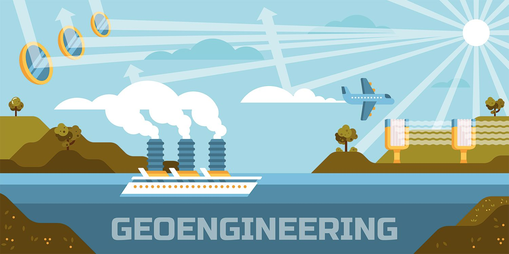
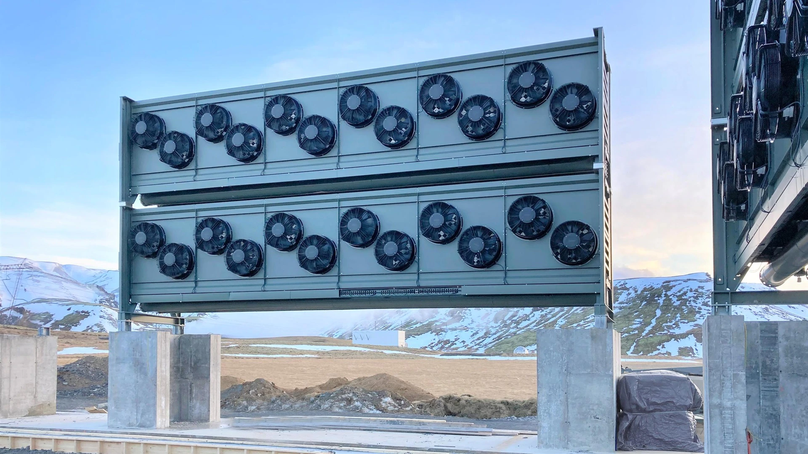

# Content
- https://de.wikipedia.org/wiki/Geoengineering
- https://www.youtube.com/watch?v=VcVsV9Yn4P4

# Images

https://mir-s3-cdn-cf.behance.net/project_modules/max_1200/41ee1623782345.56328b40b87b0.jpg

 

https://blog.ecosia.org/content/images/2020/02/geoengineering-carbon-capture-blog-ecosia.jpg

 

https://www.swissinfo.ch/resource/image/46910274/landscape_ratio16x9/1920/1080/fb9334bb5860011eb3d72966080201fe/472D9778AC76667D12950F3FF98A008C/climeworks-direct-air-capture---storage-plant-orca_1.jpg

